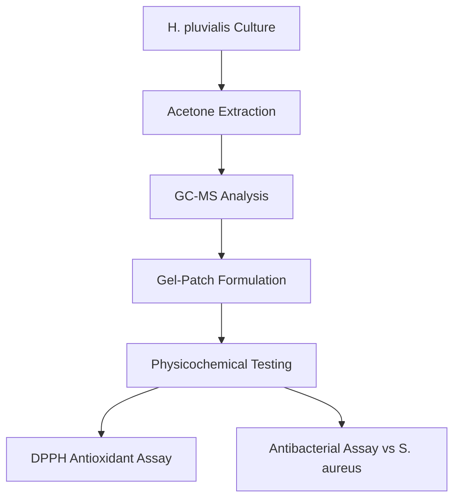
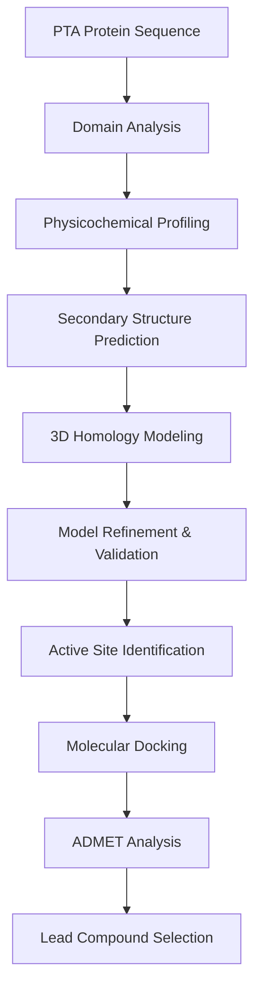

# In Silico Characterization of Cell Wall Enzyme Targeting in MRSA Using *Haematococcus pluvialis* Bioactive Compounds

[](https://opensource.org/licenses/MIT)
[](https://doi.org/)
[](https://www.python.org/downloads/)
[](https://github.com)

## 📋 Table of Contents
- [Overview](#overview)
- [Key Highlights](#key-highlights)
- [Research Methodology](#research-methodology)
- [Results Summary](#results-summary)
- [Installation & Requirements](#installation--requirements)
- [Project Structure](#project-structure)
- [Usage](#usage)
- [Datasets](#datasets)
- [Key Findings](#key-findings)
- [Future Directions](#future-directions)
- [Citation](#citation)
- [Contributors](#contributors)
- [License](#license)

## 🔬 Overview

This research presents a comprehensive **in vitro** and **in silico** approach to combat Methicillin-Resistant *Staphylococcus aureus* (MRSA) using bioactive compounds from the microalgae ***Haematococcus pluvialis***. The study combines experimental gel-patch formulation with computational drug discovery to target a critical cell wall biosynthesis enzyme.

### The Challenge
- **MRSA** is a critical global health threat due to multidrug resistance
- Conventional antibiotics face increasing resistance mechanisms
- Need for novel, biocompatible antimicrobial agents

### Our Solution
- **Target**: Polyisoprenyl-teichoic acid--peptidoglycan teichoic acid transferase (PTA)
- **Drug Source**: Acetone extract of *H. pluvialis* loaded in biocompatible gel patches
- **Approach**: Dual in vitro validation + in silico screening of 15 bioactive compounds

## ✨ Key Highlights

### 🎯 Novel Drug Target
- **PTA enzyme** from the LCP (LytR-CpsA-Psr) family
- Essential for bacterial cell wall integrity
- **Selective targeting**: Absent in human cells, minimizing host toxicity
- Conserved Cps2A domain (residues 62-310) identified as binding site

### 🧪 Experimental Validation
- **Antioxidant Activity**: IC₅₀ = 24.23 µg/mL (DPPH assay)
- **Antibacterial Activity**: 5-7 mm inhibition zones (extract), 1-3.5 mm (gel-patch)
- **Gel-Patch Stability**: 6-month shelf life at 4°C
- **Safety**: Zero skin irritation, reduced toxicity vs. traditional formulations

### 💊 Lead Compounds Identified
1. **Linoleic Acid** - Best overall candidate (-5.6 kcal/mol binding affinity)
2. **1,1'-Bicyclooctyl** - Highest binding affinity (-7.2 kcal/mol)
3. **4H-1,3-Benzodioxin-4-one derivative** - Strong binding (-6.1 kcal/mol)

### 📊 Computational Insights
- **15 bioactive compounds** characterized via GC-MS
- Comprehensive ADMET profiling completed
- Molecular docking revealed **synergistic dual-targeting strategy**
- All lead compounds showed favorable drug-likeness and safety profiles

## 🔄 Research Methodology

### Experimental Workflow



### Computational Workflow



## 📈 Results Summary

### Gel-Patch Performance

| Parameter | Value | Significance |
|-----------|-------|--------------|
| **Initial Thickness** | 5 mm | Customizable for wound coverage |
| **Final Thickness** | 3.5 mm (after 6h) | Stable matrix integrity |
| **Moisture Loss** | 24% reduction | Enhanced hydration control |
| **Shelf Life** | 6 months (4°C) | Improved over DEE spray |
| **Gelation Time** | 30-60 seconds | Practical application window |

### Antioxidant Activity (DPPH Assay)

| Concentration (µg/mL) | Inhibition (%) |
|----------------------|----------------|
| 25 | 51.65 |
| 50 | 69.20 |
| 75 | 78.55 |
| 100 | 86.21 |
| 125 | 91.33 |
| **IC₅₀** | **24.23** |

### Antibacterial Activity Against *S. aureus*

| Sample | Concentration (µg/well) | Zone of Inhibition (mm) |
|--------|------------------------|-------------------------|
| **Extract** | 100 | 5.13 ± 0.06 |
| | 400 | 7.40 ± 0.00 |
| **Gel-Patch** | 100 | 1.03 ± 0.06 |
| | 400 | 3.47 ± 0.06 |
| **Standard** | - | 9.97 ± 0.06 |

### Protein Characterization

| Property | Value | Interpretation |
|----------|-------|----------------|
| **Molecular Weight** | 46,041.65 Da | Full-length functional protein |
| **Theoretical pI** | 6.16 | Slightly acidic |
| **Instability Index** | 35.25 | Stable protein |
| **Aliphatic Index** | 85.07 | Thermostable |
| **GRAVY Score** | -0.679 | Hydrophilic nature |
| **α-Helix** | 31.86% | Structured catalytic core |
| **Random Coil** | 56.13% | Flexible termini |

### Top Molecular Docking Results

| Compound | PubChem ID | Binding Affinity (kcal/mol) | Key Interactions |
|----------|------------|----------------------------|------------------|
| **1,1'-Bicyclooctyl** | 524587 | -7.2 | VAL152, ILE245, ILE261 |
| **4H-1,3-Benzodioxin-4-one** | 593156 | -6.1 | ALA232, ILE245, ILE261, ALA265, LEU269 |
| **Chloramphenicol (Control)** | 5959 | -5.9 | HIS254, ILE261 |
| **Linoleic Acid** | 5280450 | -5.6 | ILE245, HIS254, ILE261 (+ H-bonds) |
| **Oleic Acid** | 445639 | -5.5 | GLY249, HIS254, VAL152 |
| **Gentamicin (Control)** | 3467 | -5.3 | ASP40, ASN43, GLU83, LYS253 |

## 🛠️ Installation & Requirements

### Software Dependencies

```bash
# Bioinformatics Tools
- PyMOL (Protein visualization)
- AutoDock Vina (Molecular docking)
- PyRx (Docking interface)
- UCSF Chimera (Structure analysis)

# Web-based Tools
- NCBI CD-Search (Domain analysis)
- ProtParam (Physicochemical properties)
- SOPMA (Secondary structure)
- PSIPRED (Structure prediction)
- AlphaFold / RoseTTAFold (3D modeling)
- SWISS-MODEL (Homology modeling)
- CASTp (Binding site prediction)

# ADMET Analysis Tools
- SwissADME (Pharmacokinetics)
- Molinspiration (Drug-likeness)
- ProTox-II / GUSAR (Toxicity prediction)
- VEGA (Toxicological profiling)
```

### Python Environment

```bash
# Create virtual environment
python -m venv mrsa_project
source mrsa_project/bin/activate  # On Windows: mrsa_project\Scripts\activate

# Install required packages
pip install -r requirements.txt
```

### Requirements.txt

```txt
biopython==1.81
numpy==1.24.3
pandas==2.0.3
scipy==1.11.1
matplotlib==3.7.2
seaborn==0.12.2
rdkit==2023.3.2
openbabel==3.1.1
prody==2.4.0
pymol-open-source==2.5.0
```

## 📁 Project Structure

```
MRSA-H.pluvialis-Drug-Discovery/
│
├── data/
│   ├── protein/
│   │   ├── WP_412521717.1.fasta          # Target protein sequence
│   │   ├── alphafold_model.pdb            # Best refined model
│   │   └── model_validation.txt           # Ramachandran & quality scores
│   │
│   ├── ligands/
│   │   ├── gc_ms_compounds.sdf            # 15 bioactive compounds
│   │   ├── controls.sdf                   # Chloramphenicol, Gentamicin
│   │   └── compound_properties.csv        # ADMET data
│   │
│   └── experimental/
│       ├── dpph_assay_results.csv
│       ├── antibacterial_assay.csv
│       └── gel_patch_characterization.csv
│
├── analysis/
│   ├── protein_characterization/
│   │   ├── domain_analysis.py
│   │   ├── secondary_structure.py
│   │   └── model_validation.py
│   │
│   ├── molecular_docking/
│   │   ├── prepare_ligands.py
│   │   ├── docking_protocol.py
│   │   ├── active_site_docking.py
│   │   └── interaction_analysis.py
│   │
│   └── admet_screening/
│       ├── lipinski_filter.py
│       ├── pharmacokinetics.py
│       └── toxicity_prediction.py
│
├── results/
│   ├── figures/
│   │   ├── gel_patch_evaluation.png
│   │   ├── dpph_antioxidant.png
│   │   ├── protein_structure.png
│   │   ├── docking_interactions.png
│   │   └── binding_pockets.png
│   │
│   └── tables/
│       ├── antibacterial_activity.csv
│       ├── physicochemical_properties.csv
│       ├── docking_results.csv
│       └── admet_summary.csv
│
├── notebooks/
│   ├── 01_protein_analysis.ipynb
│   ├── 02_compound_screening.ipynb
│   ├── 03_molecular_docking.ipynb
│   └── 04_result_visualization.ipynb
│
├── scripts/
│   ├── fetch_protein_data.sh
│   ├── prepare_docking.sh
│   └── analyze_results.py
│
├── docs/
│   ├── methodology.md
│   ├── protocols.md
│   └── supplementary_info.md
│
├── requirements.txt
├── LICENSE
└── README.md
```

## 💻 Usage

### 1. Protein Structure Analysis

```python
from analysis.protein_characterization import analyze_protein

# Load and analyze protein
protein = analyze_protein('data/protein/WP_412521717.1.fasta')

# Get physicochemical properties
properties = protein.get_properties()
print(f"Molecular Weight: {properties['mw']} Da")
print(f"Instability Index: {properties['ii']}")

# Predict secondary structure
structure = protein.predict_secondary_structure()
structure.plot()
```

### 2. Molecular Docking

```bash
# Prepare receptor
python scripts/prepare_receptor.py \
    --pdb data/protein/alphafold_model.pdb \
    --output prepared_receptor.pdbqt

# Run docking
python analysis/molecular_docking/docking_protocol.py \
    --receptor prepared_receptor.pdbqt \
    --ligands data/ligands/gc_ms_compounds.sdf \
    --center -4.75 -11.76 5.02 \
    --size 30.51 9.73 24.98 \
    --output results/docking/
```

### 3. ADMET Screening

```python
from analysis.admet_screening import ADMETAnalyzer

# Initialize analyzer
analyzer = ADMETAnalyzer()

# Load compounds
compounds = analyzer.load_sdf('data/ligands/gc_ms_compounds.sdf')

# Run full ADMET analysis
results = analyzer.analyze_all(compounds)

# Filter for drug-like compounds
drug_like = results[results['lipinski_violations'] <= 1]

# Generate report
analyzer.generate_report(drug_like, 'results/admet_report.pdf')
```

### 4. Visualization

```python
import matplotlib.pyplot as plt
from analysis.visualization import plot_docking_results

# Load docking data
docking_data = pd.read_csv('results/tables/docking_results.csv')

# Create visualization
fig, axes = plot_docking_results(
    docking_data,
    highlight=['Linoleic Acid', '1,1\'-Bicyclooctyl'],
    control='Chloramphenicol'
)

plt.savefig('results/figures/binding_affinity_comparison.png', dpi=300)
```

## 📊 Datasets

### Input Data
- **Protein Sequence**: NCBI RefSeq `WP_412521717.1` (408 amino acids)
- **Ligand Library**: 15 compounds from GC-MS analysis of *H. pluvialis* acetone extract
- **Control Compounds**: Chloramphenicol (PubChem: 5959), Gentamicin (PubChem: 3467)

### Generated Data
- **Protein Models**: AlphaFold, RoseTTAFold, SWISS-MODEL, Phyre2, Modeller
- **Docking Poses**: ~150 ligand-protein complexes
- **ADMET Profiles**: Comprehensive toxicity and pharmacokinetic data for all compounds

### Experimental Data
- DPPH antioxidant assay (5 concentrations)
- Antibacterial activity (4 concentrations × 2 formulations)
- Gel-patch physicochemical properties

## 🔍 Key Findings

### 1. Protein Target Validation
✅ **Conserved Cps2A domain** identified (residues 62-310)  
✅ **LCP family** enzyme essential for cell wall biosynthesis  
✅ **Selective target**: Absent in humans  
✅ **Stable protein** (Instability Index: 35.25)  
✅ **Hydrophilic nature** suitable for drug targeting  

### 2. Lead Compounds

#### 🥇 Linoleic Acid (Top Choice)
- **Binding Affinity**: -5.6 kcal/mol
- **Interactions**: 7 alkyl + 2 H-bonds with key residues (ILE245, HIS254, ILE261)
- **Safety**: High LD₅₀ (10,000 mg/kg), non-toxic profile
- **Route**: Suitable for both oral and topical application
- **Mechanism**: Membrane disruption + enzyme inhibition

#### 🥈 4H-1,3-Benzodioxin-4-one Derivative
- **Binding Affinity**: -6.1 kcal/mol
- **Interactions**: 5 alkyl bonds with active site residues
- **Safety**: Toxicity Class 4, requires controlled application
- **Synergy**: Excellent when combined with Linoleic Acid

#### 🥉 1,1'-Bicyclooctyl
- **Binding Affinity**: -7.2 kcal/mol (highest)
- **Interactions**: Strong hydrophobic binding (VAL152, ILE245, ILE261)
- **Limitation**: Higher molecular weight, lower solubility

### 3. Dual-Targeting Strategy
The combination of **Linoleic Acid** and **4H-1,3-Benzodioxin-4-one** offers:
- Synergistic binding to different active site residues
- Reduced resistance development potential
- Enhanced antimicrobial efficacy
- Complementary ADMET profiles

### 4. Gel-Patch Advantages
✅ **Enhanced safety** vs. DEE spray (no volatile solvents)  
✅ **Extended shelf life** (6 months at 4°C)  
✅ **Customizable** (layerable, trimmable)  
✅ **Controlled release** of bioactive compounds  
✅ **Zero skin irritation**  
✅ **Biocompatible** formulation  

## 🎯 Future Directions

### Experimental Validation
- [ ] In vitro enzymatic assays with purified PTA
- [ ] Minimum Inhibitory Concentration (MIC) determination
- [ ] Time-kill kinetics studies
- [ ] Biofilm disruption assays
- [ ] Synergy testing with conventional antibiotics

### Advanced Computational Studies
- [ ] Molecular dynamics simulations (100 ns+)
- [ ] Binding free energy calculations (MM-PBSA/MM-GBSA)
- [ ] Resistance mutation analysis
- [ ] QSAR model development
- [ ] Pharmacophore modeling

### Clinical Development
- [ ] In vivo efficacy studies (animal models)
- [ ] Wound healing assessment
- [ ] Toxicology studies (acute, sub-chronic)
- [ ] Pharmacokinetic profiling
- [ ] Formulation optimization
- [ ] Clinical trial preparation

### Product Development
- [ ] Scale-up of gel-patch production
- [ ] Stability studies (ICH guidelines)
- [ ] Packaging optimization
- [ ] Regulatory pathway assessment
- [ ] Market analysis

## 📚 Citation

If you use this work in your research, please cite:

```bibtex
@article{rajarajan2025mrsa,
  title={In Silico Characterization of a Key Cell Wall Enzyme for targeting Methicillin-Resistant Staphylococcus aureus using Haematococcus pluvialis Bioactive compounds loaded Wound Healing Gel Patches},
  author={Rajarajan, T. P. and Bhavanee, S. Shakthi and Hari Babu, P.},
  journal={[Journal Name]},
  year={2025},
  volume={[Volume]},
  pages={[Pages]},
  doi={[DOI]}
}
```

## 👥 Contributors

### Research Team

**T. P. Rajarajan**  
Department of Biotechnology, St. Peter's College of Engineering and Technology  
Chennai – 600054, India

**S. Shakthi Bhavanee**  
Department of Biotechnology, St. Peter's College of Engineering and Technology  
Chennai – 600054, India

**Dr. P. Hari Babu** (Corresponding Author)  
Rail Vikas Nigam Limited  
Chennai – 600004, India  
📧 Email: haaribabu@gmail.com

### Affiliations
- **St. Peter's College of Engineering and Technology**, Chennai
- **Rail Vikas Nigam Limited**, Chennai


```
MIT License

Copyright (c) 2025 T. P. Rajarajan, S. Shakthi Bhavanee, P. Hari Babu

Permission is hereby granted, free of charge, to any person obtaining a copy
of this software and associated documentation files (the "Software"), to deal
in the Software without restriction, including without limitation the rights
to use, copy, modify, merge, publish, distribute, sublicense, and/or sell
copies of the Software, and to permit persons to whom the Software is
furnished to do so, subject to the following conditions:

The above copyright notice and this permission notice shall be included in all
copies or substantial portions of the Software.

THE SOFTWARE IS PROVIDED "AS IS", WITHOUT WARRANTY OF ANY KIND, EXPRESS OR
IMPLIED, INCLUDING BUT NOT LIMITED TO THE WARRANTIES OF MERCHANTABILITY,
FITNESS FOR A PARTICULAR PURPOSE AND NONINFRINGEMENT. IN NO EVENT SHALL THE
AUTHORS OR COPYRIGHT HOLDERS BE LIABLE FOR ANY CLAIM, DAMAGES OR OTHER
LIABILITY, WHETHER IN AN ACTION OF CONTRACT, TORT OR OTHERWISE, ARISING FROM,
OUT OF OR IN CONNECTION WITH THE SOFTWARE OR THE USE OR OTHER DEALINGS IN THE
SOFTWARE.
```

## Acknowledgments

- NCBI for protein sequence database and CD-Search tool
- PubChem for compound structures and properties
- AlphaFold team for protein structure prediction
- Open-source bioinformatics community

## 📞 Contact

For questions, collaborations, or access to datasets:

**Dr. P. Hari Babu**  
📧 haaribabu@gmail.com  
🏢 Rail Vikas Nigam Limited, Chennai – 600004, India

---

<div align="center">

**⭐ Star this repository if you find it helpful! ⭐**

Made with ❤️ for advancing antimicrobial research

</div>
